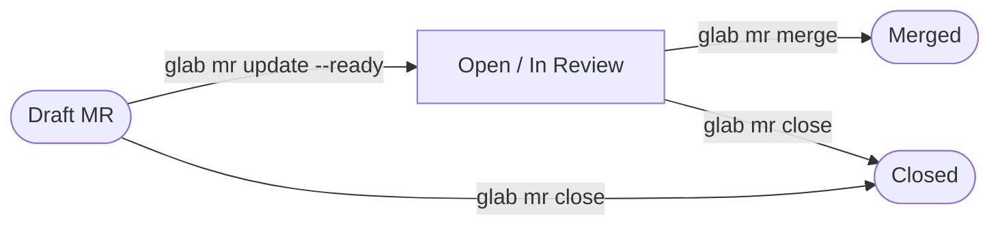

# MR Lifecycle

## State machine



## Linked issue transitions

When the MR is opened (ties to the issue lifecycle in `gitlab-track` skill):

| MR event              | Issue transition       | glab command                                                                     |
| --------------------- | ---------------------- | -------------------------------------------------------------------------------- |
| MR opened (ready)     | `in dev` → `in review` | `glab issue update N --label 'workflow::in review' --unlabel 'workflow::in dev'` |
| MR changes requested  | `in review` → `in dev` | `glab issue update N --label 'workflow::in dev' --unlabel 'workflow::in review'` |
| MR merged             | auto-closed by GitLab  | GitLab closes issues referenced by `Closes #N` on merge; no manual step needed   |
| MR closed (abandoned) | → `workflow::ready`    | `glab issue update N --label 'workflow::ready' --unlabel 'workflow::in review'`  |

## Draft → Ready

Remove Draft status when the branch is ready for review:

```bash
glab mr update <id> --ready
```

GitLab also accepts removing Draft via the web UI by clicking "Mark as ready."

## MR Board setup

→ See [shared/references/label-registry.md](../../shared/references/label-registry.md) for label definitions and `glab label create` commands.

## Cross-skill reference

Issue lifecycle (upstream of MR): [gitlab-track skill — references/issue-lifecycle.md](../../gitlab-track/references/issue-lifecycle.md)
