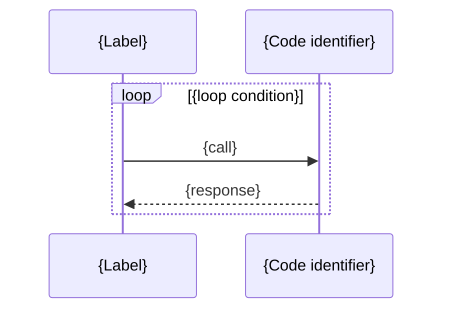

## {Description}

### {Section 1: Methods involved}

**`{MethodName}`** — `path/to/file.ext` line N:

```<lang>
// current code
{relevant code}
```

### {Section 2: Current call chain} (optional)



---

## {Impact}

---

## {Notes on <topic>} (optional)

---

## {Files affected}

- `path/to/file1.ext`
- `path/to/file2.ext` — {brief note if relevant}

---

## {Activities}

- [ ] {refactor action 1}
- [ ] {Maintain compatibility with interface X}
- [ ] {Add unit tests to verify new behavior}
