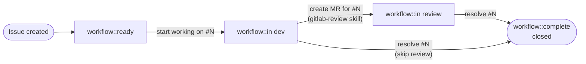

# Issue Lifecycle

## State machine



## YAML state machine (agent-parseable)

```yaml
workflow:
  states:
    - label: "workflow::ready"
      triggers:
        - "start working on #N"
        - "lavora la issue #N"
        - "pick up #N"
      transitions:
        - to: "workflow::in dev"
          glab: "glab issue update N --label 'workflow::in dev' --unlabel 'workflow::ready'"
    - label: "workflow::in dev"
      transitions:
        - triggers:
            - "create MR for #N"
            - "crea una MR per la issue #N"
          to: "workflow::in review"
          glab: "handled by gitlab-review skill"
        - triggers:
            - "resolve #N (skip review)"
            - "chiudi direttamente #N"
          to: "workflow::complete"
          glab: "glab issue update N --label 'workflow::complete' --unlabel 'workflow::in dev' && glab issue close N"
    - label: "workflow::in review"
      transitions:
        - triggers:
            - "resolve #N"
            - "risolvi #N"
            - "close #N"
            - "chiudi #N"
          to: "workflow::complete"
          glab: "glab issue update N --label 'workflow::complete' --unlabel 'workflow::in review' && glab issue close N"
```

## Transition table

| User says                  | From state            | To state                     | glab command                                                                                             |
| -------------------------- | --------------------- | ---------------------------- | -------------------------------------------------------------------------------------------------------- |
| "create an issue"          | —                     | `workflow::ready`            | Applied at creation alongside `type::*`                                                                  |
| "start working on #N"      | `workflow::ready`     | `workflow::in dev`           | `glab issue update N --label 'workflow::in dev' --unlabel 'workflow::ready'`                             |
| "create MR for #N"         | `workflow::in dev`    | `workflow::in review`        | Handled by `gitlab-review` skill                                                                         |
| "resolve #N"               | `workflow::in review` | `workflow::complete` + close | `glab issue update N --label 'workflow::complete' --unlabel 'workflow::in review' && glab issue close N` |
| "resolve #N" (skip review) | `workflow::in dev`    | `workflow::complete` + close | `glab issue update N --label 'workflow::complete' --unlabel 'workflow::in dev' && glab issue close N`    |
| "close #N"                 | any                   | `workflow::complete` + close | Same as "resolve" for current state                                                                      |

## Issue Board setup

→ See [shared/references/label-registry.md](../../shared/references/label-registry.md) for label definitions and `glab label create` commands.
