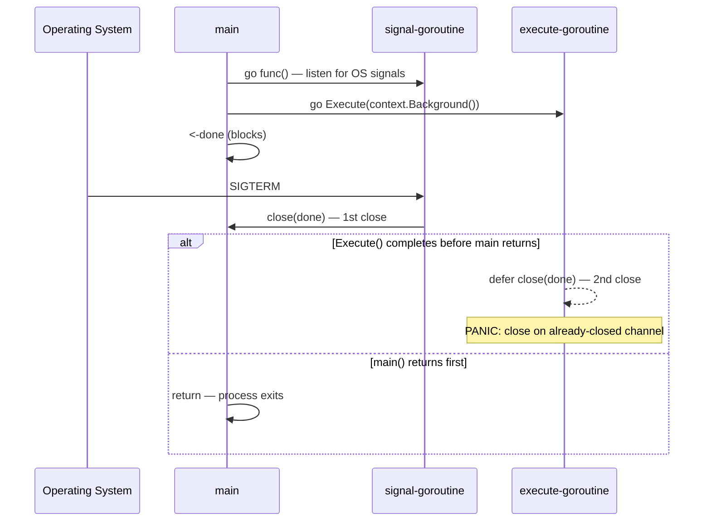
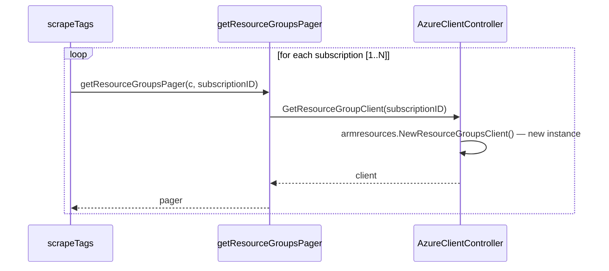
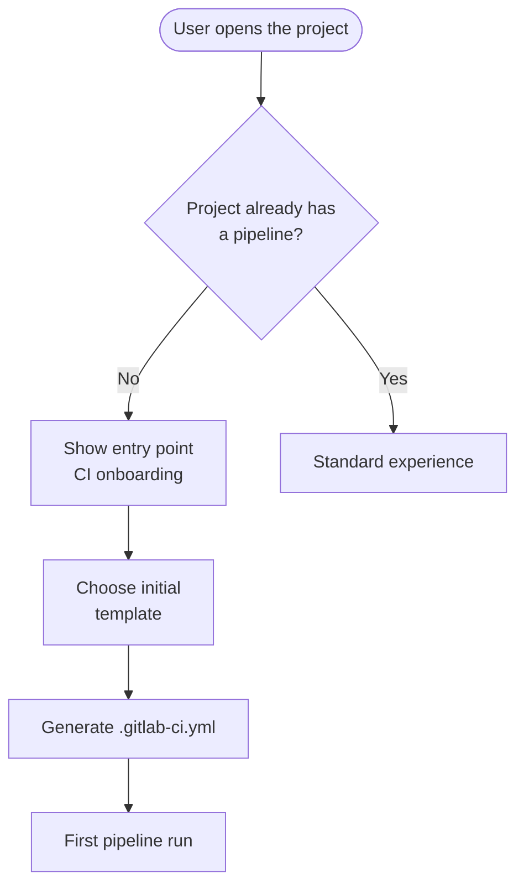

# Mermaid Patterns for GitLab Issues

Reference for mermaid diagrams to include in issues. Load only when you need to generate a diagram.

## Contents

- [Application Policy](#application-policy)
- [Language Rules](#language-rules)
- [Safe Mermaid Syntax](#safe-mermaid-syntax)
- [Pattern 1 — sequenceDiagram for Multi-Actor Bug](#pattern-1--sequencediagram-for-multi-actor-bug)
- [Pattern 2 — sequenceDiagram for Technical-Debt with Loop](#pattern-2--sequencediagram-for-technical-debt-with-loop)
- [Pattern 3 — flowchart for Feature with Converging MVC](#pattern-3--flowchart-for-feature-with-converging-mvc)
- [When NOT to Add a Diagram](#when-not-to-add-a-diagram)

## Application Policy

| Issue type       | Pattern           | When to include                                                  |
| ---------------- | ----------------- | ---------------------------------------------------------------- |
| `bug`            | `sequenceDiagram` | The issue involves >=2 actors (goroutines, processes, services)  |
| `technical-debt` | `sequenceDiagram` | The issue describes a call chain or a problematic flow           |
| `feature`        | `flowchart`       | Only if the proposal already has a defined flow (converging MVC) |
| `documentation`  | None              | Never                                                            |

## Language Rules

- **Descriptive labels** (roles, systems, concepts): use the **user's active language at runtime**
  - Examples: `Operating System`, `signal-goroutine`, `Database`, `API Client`, `Message Queue`
- **Code identifiers** (function names, structs, packages, methods): **English / original name**
  - Examples: `scrapeTags`, `AzureClientController`, `GetResourceGraphClient`, `main`

## Safe Mermaid Syntax

- Do NOT use spaces in node names/IDs or participant names. Use camelCase, PascalCase, or underscores.
- When a label contains special characters (parentheses, colons, commas), use double quotes.
- Do not use reserved keywords as node IDs: `end`, `subgraph`, `graph`, `flowchart`.

## Pattern 1 — sequenceDiagram for Multi-Actor Bug

Use when the bug is a race condition, a problematic event sequence, or an incorrect operation ordering.

Key elements:

- `participant <ID> as <descriptive label>` — the ID is a short identifier, the label is readable in the user's active language
- `->>` for synchronous call, `-->>` for return
- `alt / else / end` for conditional branches with different outcomes
- `Note over <ID>: <text>` for critical annotations (panic, unexpected behavior)
- `loop <condition> ... end` for loops (see Pattern 2)

## Pattern 2 — sequenceDiagram for Technical-Debt with Loop

Use for technical debt related to repeated operations in a loop (allocations, redundant calls, etc.).

Key elements:

- `loop <loop description>` — description is in the user's active language; may include English variables (`[1..N]`)
- Self-calls (`AC->>AC: ...`) are useful for showing internal allocations / repeated setup steps

## Pattern 3 — flowchart for Feature with Converging MVC

Use ONLY when the feature already has a defined user flow (not for proposals still in discovery).

Key elements:

- `flowchart TD` (top-down) or `LR` (left-right) depending on complexity
- Shapes: `([...])` oval for start/end, `[...]` rectangle for action, `{...}` diamond for decision
- Edge labels with `-->|"<text>"|` when they contain spaces or special characters
- ` ` for line breaks inside a label

## When NOT to Add a Diagram

- Isolated bug on a single actor / pure function → no diagram
- Local technical debt (e.g., variable name, single-function refactor) → no diagram
- Feature discovery / exploratory proposal → no diagram
- Documentation issue → NEVER a diagram
