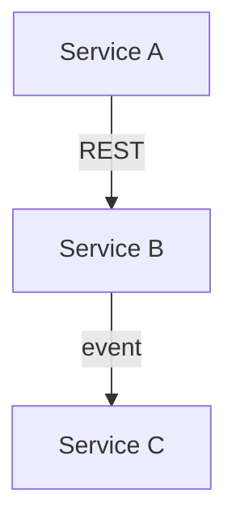

## Overview

[What is being built technically and what are the main design decisions.]

---

## Context and constraints

[Why this design? What constraints drove the decisions — performance requirements,
existing contracts, team conventions, timeline?
A future reader must understand the why, not just the what.]

---

## Architecture

[How does the system change? New services? New inter-service calls? New async flows?
Use ASCII or Mermaid diagrams where helpful.]



---

## API changes

### New endpoints

#### `[METHOD] /path`

**Request:**

```json
{
  "field": "type"
}
```

**Response (200):**

```json
{
  "field": "type"
}
```

**Error responses:**

| Status | Condition |
| ------ | --------- |
| 400 | [condition] |
| 404 | [condition] |

### Modified endpoints

[List existing endpoints that change, with a before/after diff of the contract.]

---

## Data model changes

### New tables / collections

```sql
CREATE TABLE [name] (
  -- fields
);
```

### Modified tables

[Describe fields added/removed/changed. State whether the changes are backward-compatible.]

### Migration strategy

[How is the migration applied? Is downtime required? Is a feature flag needed?]

---

## Service impact

[For each service that changes, describe what changes and why.]

| Service | Impact | Notes |
| ------- | ------ | ----- |
| [service-name] | [New endpoint / Modified behavior / New dependency] | [notes] |

---

## Cross-service dependencies

[If this change requires coordinated updates across multiple services or repos, list the deploy order.]

1. Deploy [service A] with backward-compatible change.
2. Deploy [service B] consuming the new contract.
3. Remove the backward-compatibility shim from [service A].

---

## Alternatives considered

[Other approaches evaluated and why they were rejected. This context matters: without it,
future readers will re-evaluate the same options.]

### Alternative 1: [Name]

[Description and reason for rejection]

---

## Risks and mitigations

| Risk | Probability | Impact | Mitigation |
| ---- | ----------- | ------ | ---------- |
| [Risk] | Low / Medium / High | Low / Medium / High | [mitigation] |

---

*Next step: `/feature:plan`*
